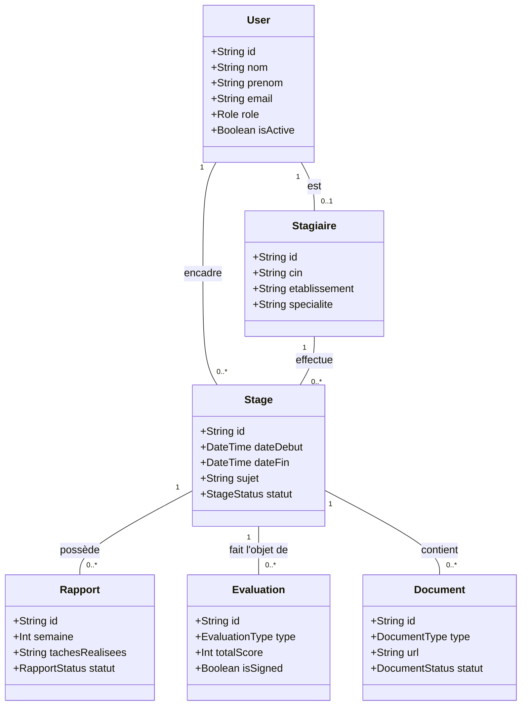
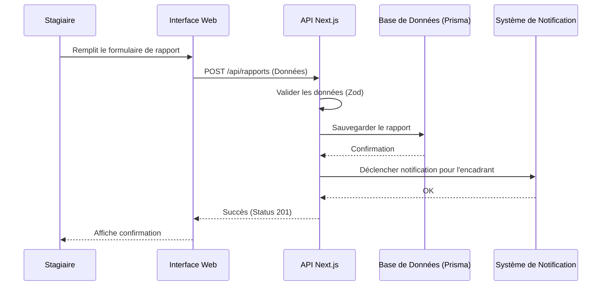

# DOSSIER DE CONCEPTION CONCEPTUELLE
## Projet : InternFlow — Système de Gestion de Stagiaires
### Stage de Fin d'Études (SFE)

---

## 1. Introduction

### 1.1 Présentation du Projet
Le projet **InternFlow** est une plateforme web full-stack conçue pour centraliser et optimiser la gestion du cycle de vie des stagiaires au sein d'une organisation. De l'intégration à l'évaluation finale, le système facilite la communication entre les stagiaires, leurs encadrants et le département RH.

### 1.2 Objectifs
- **Automatisation** : Réduire la charge administrative liée à la génération de documents (conventions, attestations).
- **Suivi en temps réel** : Offrir une visibilité sur l'avancement des projets via l'intégration avec GitHub.
- **Transparence** : Centraliser les rapports hebdomadaires et les évaluations de compétences.
- **Sécurité** : Garantir la confidentialité des données personnelles (RGPD) et la traçabilité des actions.

---

## 2. Analyse des Besoins

### 2.1 Besoins Fonctionnels
Le système s'articule autour de quatre profils utilisateurs majeurs :

#### A. Profil Stagiaire
- Gérer son profil personnel et académique.
- Soumettre des rapports hebdomadaires d'activité.
- Lier son dépôt GitHub pour le suivi technique.
- Consulter ses évaluations et documents officiels.

#### B. Profil Encadrant
- Suivre l'assiduité et l'avancement des stagiaires assignés.
- Valider les rapports hebdomadaires et fournir des feedbacks.
- Réaliser les évaluations de mi-parcours et de fin de stage.
- Visualiser les statistiques d'activité GitHub des stagiaires.

#### C. Profil Responsable RH
- Valider les dossiers d'inscription des stagiaires.
- Générer les documents administratifs (Conventions, Attestations).
- Superviser l'ensemble des stages via un tableau de bord analytique.
- Gérer les workflows de validation finale.

#### D. Profil Administrateur
- Gérer les comptes utilisateurs et les rôles (RBAC).
- Configurer les paramètres du système (grilles d'évaluation, templates).
- Consulter les logs d'audit pour la sécurité.

### 2.2 Besoins Non-Fonctionnels
- **Disponibilité** : L'application doit être accessible 24/7.
- **Performance** : Temps de réponse inférieur à 2 secondes pour les opérations critiques.
- **Ergonomie** : Interface intuitive et responsive (Mobile First).
- **Sécurité** : Authentification forte (2FA), chiffrement des données et protection contre les failles OWASP.
- **Maintenabilité** : Code typé (TypeScript) et architecture modulaire.

---

## 3. Conception Fonctionnelle (UML)

### 3.1 Diagramme de Cas d'Utilisation
Ce diagramme illustre les interactions entre les acteurs et les fonctionnalités principales du système.

```mermaid
useCaseDiagram
    actor "Stagiaire" as S
    actor "Encadrant" as E
    actor "Responsable RH" as RH
    actor "Administrateur" as A

    package "Gestion des Stages" {
        usecase "Gérer son profil" as UC1
        usecase "Soumettre Rapport" as UC2
        usecase "Consulter Évaluations" as UC3
        usecase "Valider Rapport" as UC4
        usecase "Évaluer Stagiaire" as UC5
        usecase "Générer Documents" as UC6
        usecase "Gérer Utilisateurs" as UC7
        usecase "Consulter Logs" as UC8
    }

    S --> UC1
    S --> UC2
    S --> UC3
    
    E --> UC4
    E --> UC5
    E --> UC3
    
    RH --> UC6
    RH --> UC3
    
    A --> UC7
    A --> UC8
```

### 3.2 Diagramme de Classes
Ce diagramme représente la structure statique du système et les relations entre les entités métier.



### 3.3 Diagramme de Séquence (Exemple : Soumission d'un Rapport)
Ce diagramme détaille les échanges entre les composants lors de la soumission d'un rapport par un stagiaire.



---

## 4. Conception de la Base de Données

### 4.1 Dictionnaire de Données

#### Table : User
| Nom du Champ | Type | Contraintes | Description |
| :--- | :--- | :--- | :--- |
| id | String (UUID) | PK | Identifiant unique de l'utilisateur |
| email | String | Unique | Adresse email (Login) |
| passwordHash | String | - | Mot de passe sécurisé (bcrypt) |
| role | Enum | ADMIN, RH, ENCADRANT, STAGIAIRE | Rôle système (RBAC) |
| isActive | Boolean | Default: true | État du compte |

#### Table : Stagiaire
| Nom du Champ | Type | Contraintes | Description |
| :--- | :--- | :--- | :--- |
| id | String (UUID) | PK | Identifiant unique |
| userId | String (UUID) | FK (User) | Lien vers le compte utilisateur |
| cin | String | Unique | Carte d'Identité Nationale |
| etablissement | String | - | École ou Université d'origine |

#### Table : Stage
| Nom du Champ | Type | Contraintes | Description |
| :--- | :--- | :--- | :--- |
| id | String (UUID) | PK | Identifiant unique |
| stagiaireId | String (UUID) | FK (Stagiaire) | Le stagiaire concerné |
| encadrantId | String (UUID) | FK (User) | L'encadrant assigné |
| sujet | String | - | Titre ou description du projet |
| statut | Enum | PLANIFIE, EN_COURS, TERMINE... | État actuel du stage |

---

## 5. Architecture Technique

### 5.1 Stack Technologique
L'application repose sur une stack **T3-like** moderne, privilégiant la robustesse et la rapidité de développement.

- **Frontend** : [Next.js 14+](https://nextjs.org/) (App Router) avec TypeScript.
- **Styling** : [TailwindCSS](https://tailwindcss.com/) & [shadcn/ui](https://ui.shadcn.com/) pour une interface premium.
- **Backend** : Route Handlers Next.js (API RESTful).
- **Base de Données** : [PostgreSQL](https://www.postgresql.org/) hébergée sur une instance sécurisée.
- **ORM** : [Prisma](https://www.prisma.io/) pour une gestion de données typée.
- **Authentification** : [NextAuth.js](https://next-auth.js.org/) avec support 2FA.
- **Stockage** : [S3-Compatible Storage](https://aws.amazon.com/s3/) pour les documents et justificatifs.

### 5.2 Sécurité & Protection des Données
- **RBAC (Role-Based Access Control)** : Contrôle d'accès strict côté serveur.
- **Validation Zod** : Toutes les entrées API sont validées et sanitizées.
- **Chiffrement** : Utilisation de TLS 1.3 pour le transport et bcrypt pour les mots de passe.
- **Conformité RGPD** : Gestion des consentements et possibilité de suppression des données personnelles.

---

## 6. Conclusion
Ce dossier conceptuel définit les fondations techniques et fonctionnelles du projet InternFlow. La structure modulaire et le choix des technologies assurent une évolutivité aisée pour l'ajout de nouvelles fonctionnalités futures (ex: IA pour l'analyse de rapports, application mobile dédiée).
